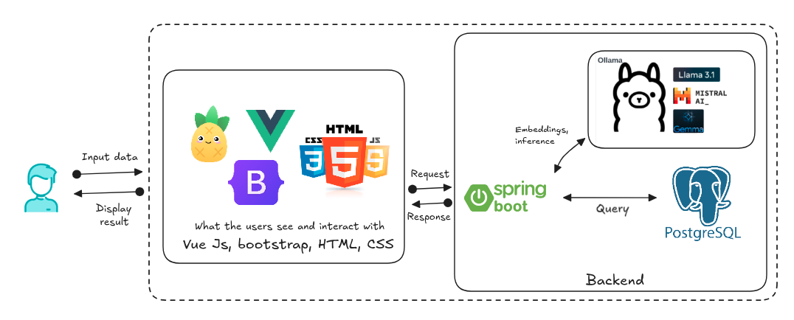

# Hệ thống Quản lý Danh tính và Truy cập (IAM)

Dự án này là một Hệ thống Quản lý Danh tính và Truy cập (Identity and Access Management - IAM) toàn diện, được thiết kế để cung cấp khả năng xác thực, ủy quyền mạnh mẽ và quản lý đa tổ chức (multi-tenancy). Hệ thống này bao gồm một API RESTful backend được xây dựng bằng Spring Boot và một giao diện người dùng frontend được phát triển bằng Vue.js.

## Video Demo

[](https://www.youtube.com/watch?v=9NWvPFrLA2s&t=68s)

> 📺 *Nhấn vào hình để xem video 

## Kiến trúc

### Backend (`iam-service`)

*   **RESTful API**: Cung cấp các điểm cuối (endpoints) để quản lý người dùng, vai trò, tài nguyên và chính sách.
*   **Spring Boot**: Framework chính để xây dựng ứng dụng backend.
*   **Java 21**: Ngôn ngữ lập trình được sử dụng.
*   **Spring Data JPA**: Để tương tác với cơ sở dữ liệu.
*   **PostgreSQL**: Hệ quản trị cơ sở dữ liệu quan hệ chính.
*   **Spring Security**: Để xử lý xác thực và ủy quyền.
*   **JWT (JSON Web Tokens)**: Được sử dụng cho các phiên không trạng thái sau khi xác thực.
*   **OAuth2**: Khung ủy quyền để cấp quyền truy cập an toàn.
*   **RBAC (Role-Based Access Control) + ABAC (Attribute-Based Access Control)**: Mô hình ủy quyền kết hợp để kiểm soát quyền truy cập linh hoạt.
    *   **RBAC**: Quyền truy cập dựa trên vai trò của người dùng.
    *   **ABAC**: Quyền truy cập dựa trên các thuộc tính của người dùng, tài nguyên và môi trường (được triển khai thông qua `conditionJson` trong Policy).
*   **Springdoc OpenAPI**: Để tự động tạo tài liệu API (Swagger UI).
*   **MapStruct + Lombok**: Để đơn giản hóa việc ánh xạ đối tượng và giảm boilerplate code.
*   **H2 Database**: Cơ sở dữ liệu trong bộ nhớ được sử dụng cho môi trường phát triển và thử nghiệm.
*   **Maven**: Công cụ quản lý và xây dựng dự án.
*   **Multi-tenancy**: Hỗ trợ nhiều tổ chức với dữ liệu tách biệt thông qua `OrganizationContextFilter` và `@OrganizationFilter`.

### Frontend (`iam-frontend`)

*   **Vue.js 3**: Framework JavaScript để xây dựng giao diện người dùng tương tác.
*   **Vue Router**: Để quản lý định tuyến trong ứng dụng Single Page Application (SPA).
*   **Pinia**: Thư viện quản lý trạng thái cho Vue.js.
*   **Axios**: Client HTTP dựa trên Promise để tương tác với backend API.
*   **Bootstrap 5**: Framework CSS để thiết kế giao diện người dùng.

## Các tính năng chính

*   **Quản lý người dùng**: CRUD các tài khoản người dùng.
*   **Quản lý vai trò**: Định nghĩa và gán vai trò cho người dùng.
*   **Quản lý tài nguyên**: Định nghĩa các tài nguyên được bảo vệ trong hệ thống.
*   **Quản lý chính sách**: Tạo các chính sách phức tạp với sự kết hợp của RBAC (Role-Based Access Control) và ABAC (Attribute-Based Access Control) để kiểm soát quyền truy cập chi tiết. Chính sách được định nghĩa bởi Subject (người dùng/vai trò), Resource (tài nguyên), Action (hành động), Effect (ALLOW/DENY) và Condition (điều kiện dựa trên thuộc tính như thời gian, IP, vai trò, tổ chức, v.v., được lưu trong `conditionJson`).
*   **Xác thực và Ủy quyền**: Triển khai OAuth2 và JWT cho các luồng xác thực an toàn.
*   **Đa tổ chức (Multi-tenancy)**: Hỗ trợ nhiều tổ chức với dữ liệu và cấu hình riêng biệt.

## Hướng dẫn cài đặt và chạy

### Yêu cầu

*   Java Development Kit (JDK) 21 trở lên
*   Apache Maven 3.x
*   Node.js (LTS) và npm (hoặc Yarn)
*   Docker và Docker Compose (tùy chọn, để chạy PostgreSQL)
*   PostgreSQL (tùy chọn, nếu không sử dụng Docker Compose)

### 1. Backend Setup (`iam-service`)

1.  **Clone repository:**
    ```bash
    git clone https://github.com/descent1511/vdt5-iam-system.git
    cd vdt5-iam-system/iam-service
    ```

2.  **Cấu hình cơ sở dữ liệu:**
    Bạn có thể sử dụng H2 Database (mặc định cho phát triển) hoặc PostgreSQL.

    *   **Sử dụng H2 (Mặc định)**: Không cần cấu hình thêm. Dữ liệu sẽ được khởi tạo trong bộ nhớ.
    *   **Sử dụng PostgreSQL (khuyến nghị cho sản phẩm)**:
        1.  Chỉnh sửa `src/main/resources/application.yml` và bỏ comment cấu hình PostgreSQL, đồng thời comment cấu hình H2.
            ```yml
            # PostgreSQL Configuration
            datasource:
                url: ${SPRING_DATASOURCE_URL:jdbc:postgresql://localhost:5432/iam_db}
                username: ${SPRING_DATASOURCE_USERNAME:postgres}
                password: ${SPRING_DATASOURCE_PASSWORD:15112002}
                driver-class-name: org.postgresql.Driver
            ```
        2.  Nếu bạn muốn chạy PostgreSQL bằng Docker Compose, hãy đảm bảo Docker đang chạy và chạy lệnh sau từ thư mục gốc của dự án (`vdt5-iam-system`):
            ```bash
            docker-compose up -d postgres
            ```
            (Kiểm tra `docker-compose.yml` để biết các thông tin chi tiết về cổng và tên người dùng/mật khẩu).

3.  **Tài khoản Admin :**
    Tài khoản mặc định để đăng nhập với vai trò Admin là `admin/admin123`

4.  **Build và chạy backend:**
    ```bash
    mvn clean install
    mvn spring-boot:run
    ```
    Backend API sẽ chạy trên `http://localhost:8080`. Tài liệu Swagger UI sẽ có sẵn tại `http://localhost:8080/swagger-ui.html`.

### 2. Frontend Setup (`iam-frontend`)

1.  **Điều hướng đến thư mục frontend:**
    ```bash
    cd ../iam-frontend
    ```

2.  **Cài đặt các dependency:**
    ```bash
    npm install
    ```

3.  **Cấu hình API Endpoint:**
    Mở file `src/main.js` hoặc `src/services/api.js` (tùy thuộc vào cách bạn thiết lập Axios) và đảm bảo base URL của API trỏ đến backend của bạn (mặc định là `http://localhost:8080/`).

4.  **Chạy ứng dụng frontend:**
    ```bash
    npm run dev
    ```
    Ứng dụng frontend sẽ chạy trên `http://localhost:5173`.

### 3. Chạy toàn bộ hệ thống với Docker Compose

Nếu bạn muốn chạy cả backend và frontend một cách dễ dàng bằng Docker Compose, hãy đảm bảo Docker đã được cài đặt và đang chạy.

1.  **Điều hướng đến thư mục gốc của dự án (`vdt5-iam-system`):**
    ```bash
    cd vdt5-iam-system
    ```

2.  **Build Docker images và chạy các services:**
    ```bash
    docker-compose up --build
    ```
    Lệnh này sẽ build các Docker image cho backend và frontend, sau đó khởi chạy tất cả các service bao gồm PostgreSQL.

    *   Backend sẽ có sẵn tại `http://localhost:8080`.
    *   Frontend sẽ có sẵn tại `http://localhost:80`.

## Sử dụng

Sau khi các dịch vụ backend và frontend đã chạy, bạn có thể truy cập giao diện người dùng frontend qua trình duyệt của mình (thường là `http://localhost:80`).

*   Sử dụng tài khoản  Admin để đăng nhập lần đầu.
*   Khám phá các phần Quản lý người dùng, Vai trò, Tài nguyên và Chính sách.

## Đóng góp

Mọi đóng góp đều được chào đón. Vui lòng tạo một pull request hoặc mở một issue nếu bạn có bất kỳ ý tưởng hoặc đề xuất nào. Bạn cũng có thể liên hệ qua email: `natibatian@gmail.com`.

